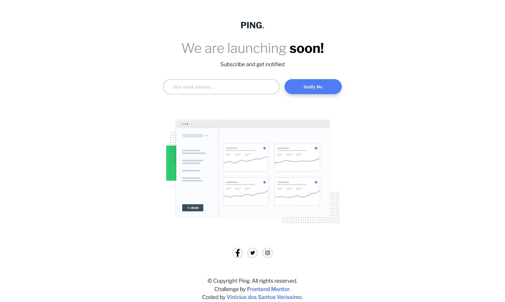

# Frontend Mentor - Ping coming soon solution

## Overview

### Screenshot

### Links

- Solution URL: https://viniciusdsv93.github.io/Ping-coming-soon/

## My process

### Built with

- Semantic HTML5 markup
- CSS custom properties
- Flexbox
- Media Queries
- JavaScript

### What I learned

In this project i could use use media queries to adapt the containers according to the screen's width.

Also, i could use JavaScript to validate the input field inside the form, checking if it's empty or if it's in the correct email format.

## Author

- GitHub - Vinícius dos Santos Verissimo (https://github.com/viniciusdsv93)
